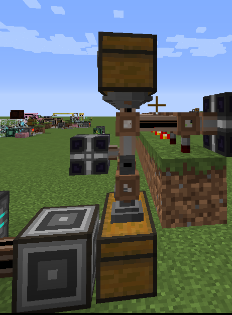
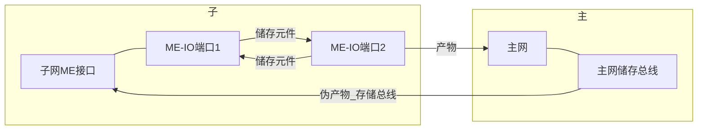

 # **前言**

>**请确保在能看懂AE2 Basic Wiki的前提下，再看AE2 Wiki。**

<figure></figure>

AE god

#  AE2 Wiki 目录

* [前言](AE2-Wiki.md#%E5%89%8D%E8%A8%80)
* [1 绪论](AE2-Wiki.md#ae2-wiki-summary)
  * [1.1 任务](AE2-Wiki.md#11-%E4%BB%BB%E5%8A%A1)
  * [1.2 路径](AE2-Wiki.md#12-%E8%B7%AF%E5%BE%84)
  * [1.3 拆解](AE2-Wiki.md#13-%E6%8B%86%E8%A7%A3)
* [2 相关的概念与结构实现](AE2-Wiki.md#2-%E7%9B%B8%E5%85%B3%E7%9A%84%E6%A6%82%E5%BF%B5%E4%B8%8E%E7%BB%93%E6%9E%84%E5%AE%9E%E7%8E%B0)
  * [2.1 ME管道传输](AE2-Wiki.md#21-me%E7%AE%A1%E9%81%93%E4%BC%A0%E8%BE%93)
  * [2.2 子网](AE2-Wiki.md#22-%E5%AD%90%E7%BD%91)
  * [2.3 包](AE2-Wiki.md#23-%E5%8C%85)
  * [2.4 指示物](AE2-Wiki.md#24-%E6%8C%87%E7%A4%BA%E7%89%A9)
  * [2.5 任务控制系统](AE2-Wiki.md#25-%E4%BB%BB%E5%8A%A1%E6%8E%A7%E5%88%B6%E7%B3%BB%E7%BB%9F)
* [3 常用进阶实现](AE2-Wiki.md#3-%E5%B8%B8%E7%94%A8%E8%BF%9B%E9%98%B6%E5%AE%9E%E7%8E%B0)
  * [3.1 卡合成（发配单份原料）](AE2-Wiki.md#31-%E5%8D%A1%E5%90%88%E6%88%90%E5%8F%91%E9%85%8D%E5%8D%95%E4%BB%BD%E5%8E%9F%E6%96%99)
  * [3.2 伪合成（高级发包）](AE2-Wiki.md#32-%E4%BC%AA%E5%90%88%E6%88%90%E9%AB%98%E7%BA%A7%E5%8F%91%E5%8C%85)
  * [3.3 单点对多点发包](AE2-Wiki.md#33-%E5%8D%95%E7%82%B9%E5%AF%B9%E5%A4%9A%E7%82%B9%E5%8F%91%E5%8C%85)
  * [3.4 倒序装填](AE2-Wiki.md#34-%E5%80%92%E5%BA%8F%E8%A3%85%E5%A1%AB)
* [4 实例](AE2-Wiki.md#4-%E5%AE%9E%E4%BE%8B)
  * [4.1 植物魔法符文祭坛](AE2-Wiki.md#41-%E6%A4%8D%E7%89%A9%E9%AD%94%E6%B3%95%E7%AC%A6%E6%96%87%E7%A5%AD%E5%9D%9B)
  * [4.2 传送机](AE2-Wiki.md#42-%E4%BC%A0%E9%80%81%E6%9C%BA)
* [5 参考文献](AE2-Wiki.md#5-%E5%8F%82%E8%80%83%E6%96%87%E7%8C%AE)

# 1 绪论

>教程会出现很多独创或借鉴术语，较难理解的术语会有相应的定义，术语用「」表示。 这样在描述实现时，就能直接用已经抽象好的术语，直接找对应模板，根据功能选择使用
>本教程基于1.12.2稳定版 appliedenergistics2-rv6-stable-7 制作，对低版本可能有不兼容，高版本可能有更多方便的解法。

## 1.1 任务

AE自动化的本质就是任务，只有明确了任务，才能寻找完成任务的方法。比如“分子装配室合成、 其他mod的机器输入输出、植物魔法符文祭坛、花药台合成、原版AE空间塔传送”等等。 这种**明确的、没有歧义的事件表述**，都称为 **任务**。

_**任务的通常的完成手段是：以包为任务载体，将包传送到对应实现任务的网络。网络根据任务的需要，利用指示物或者任务控制系统完成任务。**_

## 1.2 路径

任务能否实现，要看是否有路径， 比如发送1个铁到箱子，首先要有1个铁，有箱子，有ME网络能「传输」，那么就有路径完成这个任务。 即：1个铁——「传输」——箱子。只有有**路径**的任务才可能完成。 再比如“在一格岩浆里钓鱼”，这个例子中，我们没有路径去实现它。 有钓竿，有岩浆，但是钓竿碰到岩浆会自动收回，这条唯一的路径被中断了，这种任务是不可能完成的

但是当我们探索自动化设计时，发现一条可能的路径被中断了，并不是说任务就不能实现了！ 事实上，有AE加持下，大部分能与AE交互的mod都能实现自动化。在这种语境下，可以说不存在AE实现不了的自动化！

## 1.3 拆解

在设计自动化时，有一种很重要的辅助设计的手段是**拆解**，**拆解**能把设计所需的操作和结构清晰的展现出来。

举例子说明

比如合成植物魔法的符文，拆解如下

第一步：物品——符文祭坛——回收产物，

进一步：ME发送物品——花格箱——符文祭坛——回收产物，

再进一步：ME接口发送物品——子网传输到花格箱「卡合成」——符文祭坛工作——完成后激活祭坛——收回产物——完成「卡合成」。

到这一步就可以尝试设计结构了。

在实例部分，会有拆解的思维导图。 用图说话会让结构非常清晰，而且能更容易发现可能的优化结构。 建议在学完全套教程之后，养成在设计AE系统时作图的习惯。

# 2 相关的概念与结构实现

>在这一章中，「结构」是实现「概念」的最小单元，具体「设备」的功能被忽略了。
「结构」就是本章各节图里展示的部分，「结构」也会不严谨的称为「实现」。
「概念」就是本章各小节的标题。
举例来说，[图2.1.1 AE最简单的管道（管道4）](AE2-Wiki.md#212-%E7%AE%A1%E9%81%93%E7%9A%84%E5%AE%9E%E7%8E%B0) 中的AE网络整体「结构」，实现了[管道4](AE2-Wiki.md#211-%E4%BC%A0%E8%BE%93%E5%92%8C%E7%AE%A1%E9%81%93%E7%9A%84%E5%AE%9A%E4%B9%89)的「概念」。
在这个教程中，物品/数据从A点发送到B点只有两种方式：传输和发包。 传输和发包的区别和联系，在发包那一节介绍。

## 2.1 ME管道传输

>从这一节开始介绍AE自动化的进阶理论，缺AE基础的小伙伴应补完基础再继续往下看。

### 2.1.1 「传输」和「管道」的定义

「传输」的定义：将ME网络中的「数据」（比如存储元件的东西）或「物品」（比如箱子内的东西）传送到指定「容器」或「网络」里。定义「传输」行为的载体为「ME管道」，简称「管道」。

「物品」和「数据」的区别是：是否在存储元件中。**这样定义的好处是：可以方便的选择对应的ME管道，每种ME管道都有自己的控制特性**。

记：

数据→数据为「管道」1 (比如移动存储元件）

数据→物品为「管道」2

物品→数据为「管道」3

物品→物品为「管道」4

### 2.1.2 「管道」的实现

<figure><figcaption>

</figcaption></figure>

图2.1.1  AE最简单的管道（传输4）

特点：无需me控制器，无需调配置（也可以折腾存储总线），需供电，体积小功能少

<figure><figcaption>

</figcaption></figure>

图2.1.2  快传（传输1）

特点：速度快，可以与元件工作台配合，传输指定物品到另一网络

<figure><figcaption>

</figcaption></figure>

图2.1.3  可以增加控制的管道（传输4）

特点：输出总线要调成想输出的「物品」，可以加红石卡模糊卡等进行控制，需供电（注意左下角的输入总线在这个结构是没用的，因为输入总线不能读取箱子里的信息）

<figure><figcaption>

</figcaption></figure>

图2.1.4  根据网络数据条件控制的管道（传输2）

需要me控制器，输出总线和前面一样可以调配置，存储总线可以直接将输入网络的「数据」变成「物品」，体积大功能多。

<figure><figcaption>

</figcaption></figure>

图2.1.5  根据目标网络数据进行条件控制的管道（传输4）

在需要子网反馈控制的设计中可以使用类似这种结构，这种思路在[3.1卡合成](AE2-Wiki.md#31-%E5%8D%A1%E5%90%88%E6%88%90%E5%8F%91%E9%85%8D%E5%8D%95%E4%BB%BD%E5%8E%9F%E6%96%99)和[3.3单点对多点发包](AE2-Wiki.md#33-%E5%8D%95%E7%82%B9%E5%AF%B9%E5%A4%9A%E7%82%B9%E5%8F%91%E5%8C%85)中有用到。

## 2.2 子网

> 「子网」是一切复杂的AE操作的前提。因为不可能主网络去实现所有操作，"机器IO、增加频道、打包合成"等等操作用主网实现过于繁琐，有些也很难实现。合理运用子网可以减少很多工程量。要理解子网的本质功能就是一段程序
  或者说是函数。主网对子网有信号、数据输入，子网有相应的输出。

### 2.2.1「子网」的定义

「主网」就是主要的ME网络，**功能包括绝大多数数据的储存，发起合成，机器的调用等等**。

「子网」就是相对于主网而言，被主网调用或者使用主网功能的，与主网有信息/数据交互的，**独立于主网的网络**。

简单来说，子网是打工人，主网是公司，子网从主网中获得生产所需原料和命令，将产物反馈给主网。

### 2.2.2「子网」的实现

<figure><figcaption>

</figcaption></figure>

图2.2.1  ME接口真泛用

不用解释吧。

<figure><figcaption>

</figcaption></figure>

图2.2.2  P2P也很好用的赛

绿色子网输出物品到箱子，粉红主网抽取箱子的物品。这种借助用P2P实现的子网也很常见，能有效的节省空间。

<figure><figcaption>

</figcaption></figure>

图2.2.3  不得了的秘密

这个结构可以用来完成伪合成，本质是一个子网。

「主网」用储存总线和ME-IO端口（右）与子网进行交互，在实例[3.2 伪合成](AE2-Wiki.md#32-%E4%BC%AA%E5%90%88%E6%88%90%E9%AB%98%E7%BA%A7%E5%8F%91%E5%8C%85) 中会重点介绍。

## 2.3 包

>包通常在复杂项目中，起中间作用，甚至核心作用。

### 2.3.1「包」的定义

「包」：在指定任务中，一堆有“意义”的物品。

「发包」：把「包」，在“任务要求的时间端内”发送到指定的网络/容器。

### 2.3.2「发包」的实现 

<figure><figcaption>

</figcaption></figure>

图2.3.1 自动化の开端

就是简单的发布合成…可以用「[伪合成](AE2-Wiki.md#32-%E4%BC%AA%E5%90%88%E6%88%90%E9%AB%98%E7%BA%A7%E5%8F%91%E5%8C%85)」取消占用合成储存器

<figure><figcaption>

</figcaption></figure>

图2.3.2 多用小能手

激活拉杆，左边箱子物品通过ME-IO端口中转，进入右边箱子。

这个结构和图2.3.1的不同的是不用发布合成就能发包，极限理论传输很快（40960物品/s），而且可以通过设置IO端口内存储元件设置传输的数量。

<figure><figcaption>

</figcaption></figure>

图2.3.3 传输变发包

ME接口发送到箱子，输入总线一次最多取出96个物品（包）（4加速卡）。当上面箱子需要「包」，通过发信器从下方箱子取「包」。

### 2.3.3「发包」的作用和说明 

「发包」和[「传输」](AE2-Wiki.md#21-me%E7%AE%A1%E9%81%93%E4%BC%A0%E8%BE%93)的区别，主要在于：1、任务对时序、速度的要求。2、体积代价和效率代价的平衡

「发包」**在复杂合成中担任重要的作用，因为输入输出总线只能完成「传输」的操作，是串行的，不能用在对「包」整体性要求高的合成中。**

「包」发送物品的同时，可以封装很多信息 （例如[「指示物」](AE2-Wiki.md#24-%E6%8C%87%E7%A4%BA%E7%89%A9)），可以用来寻址，就像计算机网络中的地址段；也可以嵌套包，在未来的实例可能会介绍。在下一节中会详细介绍「指示物」。

同时，「包」是一种**抽象**，表示该物品序列在“完成任务过程”中不会被修改，但是「包」不一定要“包起来”。「发包」简化成「传输」，可以节省很多体积，在[4.2 传送机](AE2-Wiki.md#42-%E4%BC%A0%E9%80%81%E6%9C%BA)设计中有介绍。

## 2.4 指示物
>「指示物」在条件判断和条件选择中起着关键作用，“指示”功能类比于计算机语言中的"IF"

### 2.4.1「指示物」的定义 

「指示物」：是「包」里的，指定「包」内其他物品的“属性”的，自定义物品。

### 2.4.2「指示物」的实现 

<figure><figcaption>

</figcaption></figure>

图2.4.1 频道杀手

左边箱子有「包」，「包」中有效物品，和「指示物」

发信器监测「指示物」，发出红石信号（条件判断），右边的输出总线接收信号输出，从而完成选址。

对应「指示物」可以「传输」回主网，选址完成后的新「包」可以继续操作

## 2.5 任务控制系统
>任务的完成，不仅需要「包」中的原料，也需要对原料有相应控制。在大部分任务处理中，运用「指示物」或者简单的红石控制就能完成任务的控制。但是如果是有相对的严格时序要求的，根据任务状态来开始或继续的任务，就需要更加复杂的任务控制系统来进行控制。

### 2.5.1「控制」的定义

任务在实现过程中，除了发配原料「包」外的，所需的其他操作。比如对原料的输入控制、产品的输出控制、选择下一步操作的子网等。

### 2.5.2「控制」的实现

控制的前置流程：1、用ME接口发起任务，将任务发的包送至处理网络。2、处理网络根据包中信息选择对应的 控制系统（可省略）。

#### 第一种控制

一种最常规的控制方式：在完成1、2后。3、控制系统获得**开始任务**的信息，开始「控制」任务推进。4、在完成时，控制系统获得**完成任务**的信息，将控制系统重置成**初始系统**。控制系统循环重复流程34，就能控制任务实现自动化。

这种控制方式的经典实现就是样板带标记物的符文祭坛，[https://www.bilibili.com/video/BV1ab4y1R7t2/](https://www.bilibili.com/video/BV1ab4y1R7t2/)，卡位用的标记物等同于3、 **开始任务**的信息，祭坛完成合成后的红石信号等同于4、 **完成任务**的信息。

这种处理方式的变型可以是符文祭坛的[图4.1.4 直接发包 实现2](AE2-Wiki.md#412%E8%AE%BE%E8%AE%A1%E5%AE%9E%E7%8E%B0-)，那个把3、4的实现合并成一个实现，简化了控制流程缩小了体积。

#### 第二种控制

和**第一种控制**一样，在完成1、2后。控制系统获得**开始任务**的信息。但是，**第二种控制**不获取**完成任务**的信息，他通过自己的时钟周期进行循环，来完成自动化。

具体来说，**第二种控制系统**3、尝试获得**开始任务**的信息，4、如果有开始任务的信息，将这个信息**锁存**，开始循环时钟周期。5、在结束循环时解锁该信息，并重新试图执行3。

这样的设计的控制系统功能强大。可以很方便的实现各种延时控制，容易配置，泛用性广。

##### 实现：

<figure><figcaption>

</figcaption></figure>

图2.5.1 时钟控制

在无任务时，漏斗和箱子组成的时钟被锁定。开始任务，ME接口发出一份原料，发信器发送**开始任务的信息，**解锁漏斗，循环开始，箱子右边的发信器发出信号，**锁存信息**。当时钟循环即将完成，将**锁存信息解锁，**读取**开始任务的信息。**至此完成一个循环。

时钟网络中的其他发信器根据时钟中的物品数量，在不同的时间间隔后发出红石信号。

在类似[倒序装填](AE2-Wiki.md#34-%E5%80%92%E5%BA%8F%E8%A3%85%E5%A1%AB)那种需要很多红石信号的控制系统中能用上。

# 3 常用进阶实现
>这部分可以参照存档进行学习。之后的教程实际效果，可能会随AE版本的不同有差异，甚至运行不了，但是思路是共通的，应该尽可能学思路而不是照抄。

## 3.1 卡合成（发配单份原料）
>在处理合成任务中，如果处理网络没有直接的来自发配网络的反馈的话，就需要卡合成的操作来实现单份原料的稳定发配。比如说植物魔法符文祭坛，发配网络向处理子网发送物品后，并不能直接监测到合成是否完成，于是主网在这种情况下，不知道什么时候应该发新一波原料。

### 3.1.1「卡合成」的定义

「卡合成」：主网在使用子网来合成时，如果没有子网的直接反馈（比如储存总线读取），为了保证合成时发送的物品是一份的，就需要「卡合成」。
如果把子网当成主体，那么主网的「卡合成」相当于子网的「锁」，可以通过一些“接口”去访问锁，这会用在一些大型项目上（如果有人做的话），比如用这个来实现临界资源的访问。

### 3.1.2「卡合成」的实现

合成通常来说都是通过ME接口发起的，ME接口有”当容器内有物品时不传送物品“模式，能根据要发送的子网的物品存储状态选择是否发送物品。这就是实现卡合成的基础。

针对ME接口的这个性质，有两个大思路：1、样板中放「指示物」或者说「占位符」，当ME接口用样板发送物品时，将样板内的占位符留在容器中，其他原料拿去处理，处理完成后将占位符取出开始下一次合成。2、样板中不放占位符，当ME接口发送一份物品过来的时候，用子网 向箱子里放占位符，同样的其他原料拿去处理，处理完成后将占位符取出放回子网开始下一次合成。

很显然第二个思路在实际中更好用，在做样板时不用考虑标记。但是相对而言这样的处理体积会更大，因为多了一个子网的操作。

<figure><figcaption>

</figcaption></figure>

图3.1.1 精致

用的是第一种思路，ME接口发送合成物品（带「标记物」）到左箱子，左箱子发送有效合成物品到右箱子，「标记物」留在左箱子。当子网完成合成物品时，（任意）发出红石信号，激活左箱子下方的主网输入总线，把 「标记物」抽回主网，单次合成完成。

图3.1.2 红石控制

第二种思路，需要说明的是这种实现并不稳定，因为红石卡有自身性质（无厘头）的延时。

图3.1.3 样板无标记实现1

上一个设计的改进版，ME接口发物品到箱子后，用发信器激活活塞，活塞将占位符推上，被破坏面板捕获进入箱子。当合成完成时，用红石信号控制，把占位符用成型面板重新放回活塞上。

图3.1.4 目前发现最简单的结构

更加精简版的设计，bug也更少，循环超过10gt就能正常运转。

如果要发送的物品过多也可以考虑用ME-IO的发包功能，详见3.3 单点对多点发包

<figure></figure>

图3.1.4 单点对多点发包 单片结构 

## 3.2 伪合成（高级发包）
>可以利用多个样板，实现超过9种物品的合成或者「发包」。

### 3.2.1 设计说明

「伪合成」的实质，就是发起合成后，欺骗**合成储存器**，让她以为合成已经完成，从而解除“正在合成”状态。

### 3.2.2 设计实现

「伪合成」能完成合成操作，是将合成原料分成多段，将其分别发送同一个子网，子网能做出最终产物返回主网。

「伪合成」通过在ME接口中放样板实现，样板的制作：样板终端在制作时选择**处理样板模式**，第一个样板的**产物**  为第二个样板的**原料**，后同，原料——产物依次排列。

其中第一个样板  放置的ME接口的模式应是”当容器内有物品时不传送物品“，其他样板放在正常ME接口中。这样能保证一次只发送一次物品，用「卡合成」来实现「伪合成」。

<figure></figure>

<figure><figcaption>

</figcaption></figure>

图3.2.1 经典结构

1、在图3.1-1鼠标指向的储存总线中   标记全部「伪合成」样板中的「产物」，优先级调高。就能实现所有进入主网络（绿）的「产物」优先进该子网。（「产物」应该选择永远不会在AE2中参与合成的物品）

2、旁边的结构，能把进入该子网的所有物品再返还主网，然后和1、一起就会形成无限循环。所以「产物」既在主网中，又不在主网中。

3、当发起合成的时候，因为「产物」缺失，所以可以发起合成。发起合成后，又因为「产物」在主网中，因此认定合成完成，于是取消“正在合成”状态。

发起合成通过ME接口进行，于是“原料”被发送到了对应的容器里，就此「伪合成」发送部分完成。

## 3.3 单点对多点发包
> 有了伪合成（高级发包），已经实现了多点对单点的发包。但是，做科技自动化时会遇到，要把「包」分配多个子网，且「包」内物品在逻辑上是不可分割的情况。为了减少样板重复使用，应该探讨单样板对多子网的发包。甚至，在搭建网络结构的时候，可以考虑路由的可能性，利用单点对多点发包，把AE做成互联网结构。

### 3.3.1设计说明

在这一节中，抽象一个网络为一个「点」，不考虑「点」的细节，只考虑如何从一点向其他很多点发送物品。要确保「包」内物品是在一个操作逻辑内完成传输的，可以尝试采用各种管道传输或者发包的操作。

对于互联网，根据计算机网络的经验，应该把是否要包的选择权交给接受点，发送权交给发送者，路由器帮助路由。~~互联网的实现在某个未来会写出来（~~

### 3.3.2设计实现

<figure><figcaption>

</figcaption></figure>

图3.3.1 利用ME-IO的发包

左上角的箱子是多「点」，右下角的箱子是单「点」。

右下角的ME接口把单份「包」发送到箱子里，箱子里的「包」通过储存总线被ME-IO端口（蓝色网络）访问，蓝IO端口模式是“数据到存储元件”“工序完成移动元件”，因此蓝IO端口内的存储元件在完成蓝网络抽取后就会呆在输出槽，这就是一个「包」。粉网络可以把蓝网络的「包」拿到左上角的ME-IO，但是多「点」可以根据自己的状态选择，要不要从粉网络中取得包。

如果选择要「包」，就让朝向ME-IO端口的储存面板工作，用的是触发总线。这样网络就取得了「包」，用完再返还存储元件给单「点」。每个多「点」都能自己选择是否需要「包」，这样就完成了单点对多点的发包。

这种发包采用单个存储元件完成，发包速率有限制，craftkuro [https://bbs.mcmod.cn/center/68394/](https://bbs.mcmod.cn/center/68394/)做了20Hz的多存储原件的发包，实现有些许复杂，有兴趣的可以自己看。

除了ME-IO发包，也有基于输入总线的发包，但是纯AE和原版实现效果不很好：

<figure><figcaption>

</figcaption></figure>

图3.3.2 熟悉不

ME接口-箱子（单点），输入总线一次最多取出96个物品（4加速卡）。当上面箱子（多点）需要「包」，通过发信器就能直接从下方箱子取「包」。图示只能实现单对两，下面箱子如果换成[抽屉控制器](https://www.mcmod.cn/item/33985.html)等类似功能的方块，就能实现单对多。

## 3.4 倒序装填
>可以用来编码...只是一个进阶实现的例子

### 3.4.1设计说明

明确倒序的要求：用ME接口发送样板材料，产物放在可搬运箱子比如潜影盒里。
哪里需要倒序装填：1、红石音乐编码。2、一些奇怪的自动化（说的就是你五彩祭坛）

### 3.4.2 设计实现

只说一种设计实现。

首先设计路线，依旧是ME接口发物品，但是为了在原料有重复的情况下，使物品不发生堆叠，必须选用只能**存放一个物品**的容器做为中继，这里用的是量子链接仓。
1、ME接口先发送第一个物品，这个物品经过量子链接仓缓存，被发送到装填了占位符的，最终成品所在的箱子1里

图3.4.1 第一步

2、把箱子1里的所有占位符抽走到占位符的缓存箱子2。

3、然后从缓存箱子2中抽走**一个**占位符到占位符缓存箱子3。

4、将剩余的缓存箱子2中的占位符抽回箱子1，这样就少了一个占位符，多了一个空白位置用来放新的物品。

图3.4.2 第四步

重复1-4。直到所有物品都填好位置
完成后，搬走原来的箱子1，换新的容器，将箱子3的占位符抽到新的箱子1。
时序的部分参考2.5 任务控制系统

效果

# 4 实例
>这部分可以参照存档进行学习

## 4.1 植物魔法符文祭坛
>这是一个非常经典且典型的设计问题，融合了「卡合成」、红石时序控制，空间优化处理等等。主要难点在于发配单份物品和收集产物。

### 4.1.1设计说明
符文祭坛合成时，没有储存总线的反馈，所以需要卡合成。处理顺序是：一份产物给祭坛-->祭坛处理完成-->收集产物-->下一份产物。因为有严格的先后次序，所以需要时序控制。~~为了方便扩展且美观，应该做空间优化处理。~~ 因为已经有单体的好解了所以不是很需要扩展堆叠，当然堆叠的效率能更高，可以自己设计。

发配单份物品可以选用[「卡合成」](AE2-Wiki.md#31-%E5%8D%A1%E5%90%88%E6%88%90%E5%8F%91%E9%85%8D%E5%8D%95%E4%BB%BD%E5%8E%9F%E6%96%99)的各类实现。森林法杖加发射器用祭坛的信号激活，收集产物可以用漏斗花或扇水仙或者破坏面板完成。解除卡合成所需红石信号可以来自祭坛处理完成发出的红石信号，也可以是收集产物的信号。然后进入下一次循环，发配单份物品。有需求可以对照[任务控制系统](AE2-Wiki.md#25-%E4%BB%BB%E5%8A%A1%E6%8E%A7%E5%88%B6%E7%B3%BB%E7%BB%9F)进行设计（其实并不很需要因为有反馈信号）。

### 4.1.2设计实现 

<figure><figcaption>

</figcaption></figure>
<figure><figcaption>

</figcaption></figure>

图4.1.1 卡合成 实现1

采用的是[图3.1.2 红石控制](AE2-Wiki.md#312%E5%8D%A1%E5%90%88%E6%88%90%E7%9A%84%E5%AE%9E%E7%8E%B0)的设计思路，产物沿着ME接口-箱子-ME管道（粉）-花格箱的顺序传输发配。后面箱子中有「标记物」，当下面箱子内容物超过2个时，将「标记物」传输进下面箱子，当合成完成时，将下面箱子的「标记物」传输到后面箱子。依此完成循环。

花药台旁边的发射器放森林法杖，后边的扇水仙吹物品到漏斗，收集产物。

这套流程的问题在于，ME输入输出总线在红石激活下的行为难以理解（奇怪的代码），对这部分的深刻解释需要看代码的具体实现。当然，很少出问题。右下角的小土包底下是粘性活塞，用来发出1tick信号。

[极简植物魔法符文祭坛自动化](https://www.bilibili.com/video/BV1ab4y1R7t2/)

图4.1.2 卡合成 实现2

视频有含有「标记物」的实现，比卡合成实现1理论上更稳定，体积更小。

<figure><figcaption>

</figcaption></figure>

图4.1.3 直接发包

采用打包机打包的设计思路。开始合成时，ME-IO中的储存元件在靠右的ME-IO中，这个ME-IO上接的输入总线有红石卡。右边的ME接口发送物品到箱子，先有红石信号让ME-IO中的储存元件空转一圈，转完一圈后得到箱子里的一份物品，再接红石信号，此时开始正式合成。每次合成完都会给输入总线一个信号让其继续发包，如此持续到循环结束。

<figure><figcaption>

</figcaption></figure>

图4.1.4 直接发包 实现2

ME接口阻挡模式，发原料送进箱子。1、合成开始时，红石比较器激活鼠标所指输入总线，将材料发送至祭坛；2、合成结束时，读取祭坛信号，激活一次输入总线，重新开始合成。循环流程2即可自动化。

图 4.1.3和图 4.1.4的问题在于，第1步的红石比较器只会根据箱子内的物品来判断是否需要发送材料，但是箱子内的物品来的时间是随机的，会出bug，因此不是一个好思路。

所以选择卡合成的图 3.1.3 或者图 3.1.4就能正常用了。

但是符文祭坛有一个问题，就是在合成完之后有一段时间的冷却。有没可能消除这个冷却的影响？

## 4.2 传送机
> 在没有别的传送mod的情况下，如何用实现传送？
  AE有空间结构，但是操作起来很麻烦。要往空间IO端口里放空间储存元件，激活，取出，寻址传输，重新放出并激活取出。这才算完成了一次传送。
  本节就以这个传送任务为例，从头到尾理一遍如何进行分解、设计、优化AE自动化。
> 
### 4.2.1 设计说明

有什么好说的？传送机还不帅？

### 4.2.2实现

#### 第一种实现

明确任务：把实体从A地点，传送到B地点，A、B是网络任意的传送点。设计要能重复使用，要便于操作。

根据空间IO端口的性质，设计如下

第一步设计物流：

网络（空间储存元件）-->A子网的空间IO端口-->网络-->B子网的空间IO端口-->网络

进一步设计红石序列（按激活顺序排列）：

主网的A地址输出总线（主网任取一空的空间储存元件）-->A地址空间IO端口(简称A端)-->子网的A地址输入总线-->子网à子网的B地址输出总线（已经存储数据的空间储存元件）-->B端-->主网的B地址输入总线（还原成空的空间储存元件）。

<figure><figcaption>

</figcaption></figure>

图4.2.1 红石结构

图中粉红色线缆是主网，红色和绿色线缆是子网。

##### 第一代设计思路 

用无线终端，利用伪合成，将“指示物”送进子网。打包机把已使用的空间储存元件和“指示物”打包，送到子网中选择地址，子网将元件送回空间IO端口，将指示物送回主网。

第一代设计流程图：

<figure><figcaption>

</figcaption></figure>

实现：

<figure><figcaption></figcaption></figure>

<figure><figcaption>

</figcaption></figure>

图4.2.2 复杂的实现

##### 第二代设计思路 

观察第一代的流程图可以发现，“指示物”在空间元件进入子网之前，并没有什么作用，因此可以节省打包的操作，直接让“指示物“进入后面的子网。这样可以减少一部分结构。

第二代流程图：

<figure><figcaption></figcaption></figure>

实现

<figure><figcaption></figcaption></figure>

<figure><figcaption></figcaption></figure>

#### 第三种实现

其实，在设计的时候，忽略了一个重要的东西。每一个传送机在设计时都只设计了一个空间IO端口，但是实际上传送机可以有不只一个空间IO端口。如果用两个分别处理输入输出，红石控制能减少很多。同时，可以不使用伪合成，配合ME存储总线进行选址，能减少一个伪合成子网，每台传送机只会占用主网频道2个。_思路来源（DoremySwee等）_

这个比前两个都简单，所以建议自己设计一下，这里不放流程图，可以自己尝试画画。

实现：

<figure><figcaption>
小巧精致（20分钟做的没优化结构）
</figcaption></figure>

# 5 参考文献

\[1] MCMOD. \[AE2]应用能源 2Applied Energistics 2 \[EB/OL]. https://www.mcmod.cn/class/260.html \
\
\[2] BILIBILI. philogo 的个人空间\_哔哩哔哩\_bilibili \[EB/OL]. https://space.bilibili.com/1601051467/channel/series

